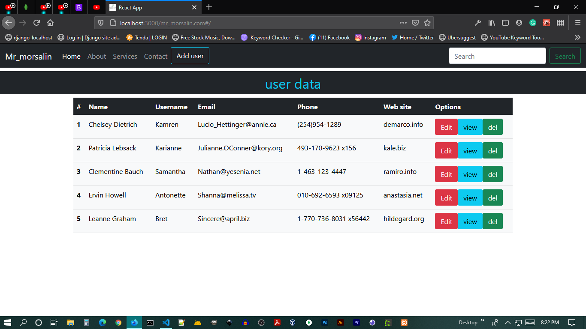

## Mern_curd

**Technology used in this project**

```
1 React
2 json server
3 node js
4 bootstrap 5
```
## Dependencies
```
"dependencies": {
    "@testing-library/jest-dom": "^5.11.8",
    "@testing-library/react": "^11.2.3",
    "@testing-library/user-event": "^12.6.0",
    "axios": "^0.21.1",
    "concurrently": "^5.3.0",
    "json-server": "^0.16.3",
    "react": "^17.0.1",
    "react-dom": "^17.0.1",
    "react-router-dom": "^5.2.0",
    "react-scripts": "4.0.1",
    "web-vitals": "^0.2.4"
  },
```

### How to Start with ? 


#### for starting json server & react dev server
```
> npm run start:dev
```

```
"scripts": {
    "predeploy": "npm run build",
    "start:dev": "concurrently \"npm start\"  \" npm run json-server \"",
    "deploy": "gh-pages -d master -d build",
    "start": "react-scripts start",
    "build": "react-scripts build",
    "test": "react-scripts test",
    "eject": "react-scripts eject",
    "json-server": "json-server --watch db.json --port 3003"
  },
```

****
- [x] Add User
- [x] Edit User
- [X] View User
- [X] Delete User

## Preview

